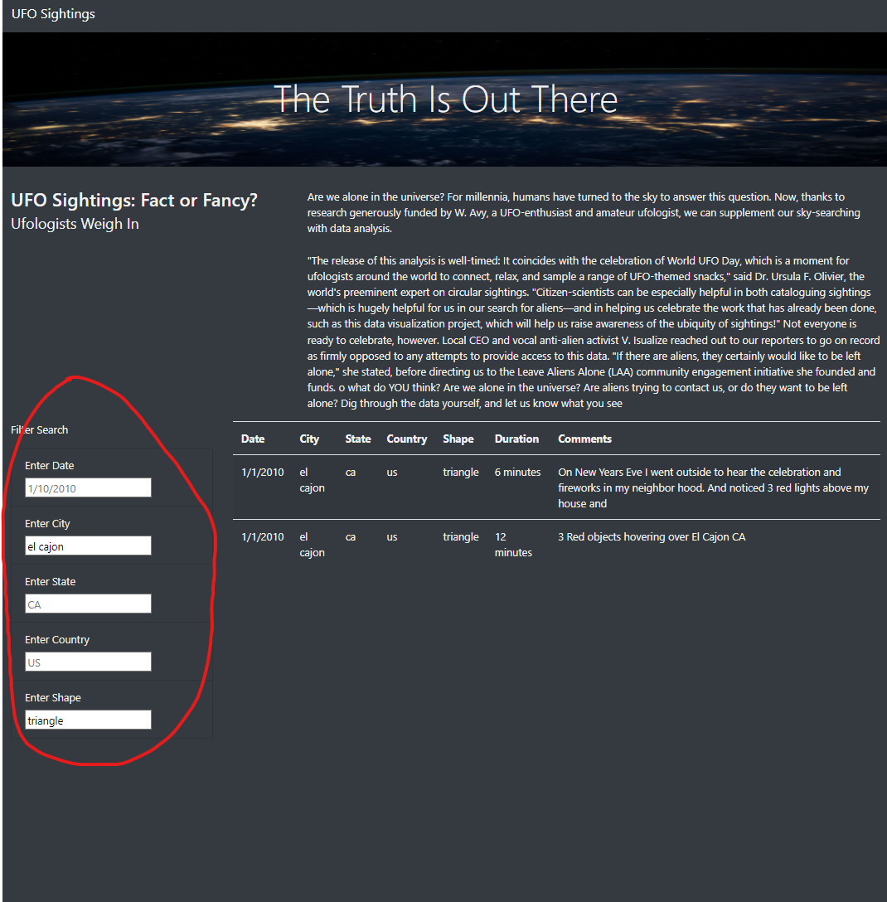

# UFOs

## Overview
In this project, we create and design a webpage using Bootstrap. This objective of this webpage is to provide users a neat and organized table of a javascript data file. This file contains all sorts of data on multiple UFO sightings. We also enable the user to search for specific instances in the dataset by filtering the data based on specific parameter(s).

## Results
Visiting the webpage, we are first welcomed with information regarding UFO sightings (i.e The title and intro paragraph). We are also greeted with a large data table that contains all the information on multiple UFO sighting entries. Next to the table is the filter search section. This section is where the user is able to pull specific instances from the data by filtering the dataset on specific parameters. Type in the parameters you want to look for and the table will retrieve entries that contain those parameters.

## Summary
In summary, this is a webpage that contains a table of multiple entries on UFO sightings. There is a section in which we can filter the data based on specific parameters. A recommendation for further development of the webpage is to maybe add more data entries to the dataset. The filter system of the data can be improved on to be more user friendly (EX: have it so that different formatting of dates can work rather than what is specified). At last, maybe add a function to reset the filter and bring back the full dataset.
